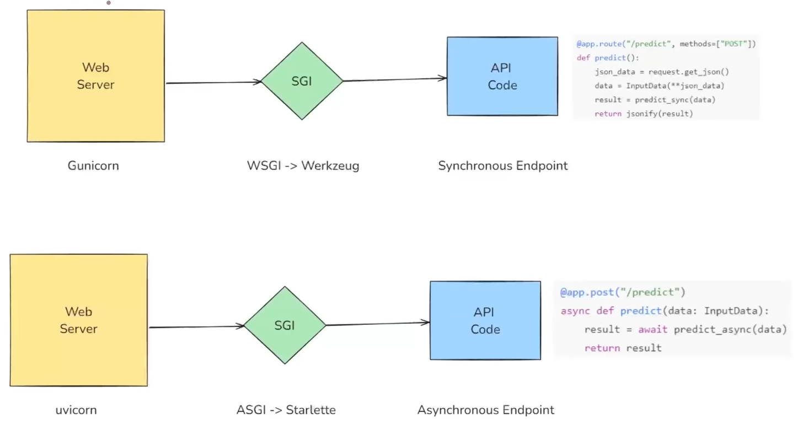

# Fast API: 
- FastAPI is a high-performance, modern web framework for building APIs with Python, based on standard Python type hints. 

# Fast API Wokring:

- 

1) **Web Server**
- **Purpose:** Acts as the first point of contact for incoming HTTP requests.

- **Functionality:** Receives client requests (like a browser or another server making an API call) and forwards them to the ASGI application.

- **Example:** Popular web servers include Nginx, Apache, or Caddy. In Python, this is often handled by Uvicorn or Hypercorn for ASGI applications.

```bash
POST /predict HTTP/1.1
Host: api.example.com
Content-Type: application/json
Content-Length: 45

{
    "feature1": 5.2,
    "feature2": 3.1
}
```
- **Role in FastAPI:** The web server listens on a port (e.g., 8000) and routes incoming HTTP requests to the ASGI layer.

2) **ASGI (Asynchronous Server Gateway Interface)**

- **Purpose:** Bridges the web server and the application code, handling the lifecycle of each request.

- **Why ASGI:** It is the asynchronous evolution of WSGI (Web Server Gateway Interface), designed to handle long-lived connections like WebSockets alongside regular HTTP traffic.

- Flow (from above image):

    * Receives the incoming HTTP request.

    * Converts it into a structured format that the FastAPI application can understand.

    * Passes it to the API code for processing.

    * Collects the response and sends it back to the web server for final delivery to the client.

    * **Benefits:** Non-blocking, scalable, and allows background tasks and real-time functionality.


# Fast API vs. Flask




# Path Parameters

- Path parameters are dynamic segments of a URL path used to identify a specific resource.