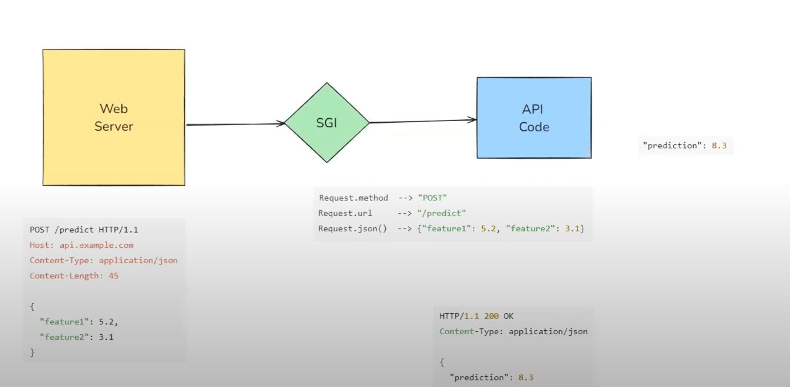

# Fast API
- FastAPI is a high-performance, modern web framework for building APIs with Python, based on standard Python type hints. 

# Fast API Wokring



1) Web Server
    - **Purpose:** Acts as the first point of contact for incoming HTTP requests.

    - **Functionality:** Receives client requests (like a browser or another server making an API call) and forwards them to the ASGI application.

    - **Example:** Popular web servers include Nginx, Apache, or Caddy. In Python, this is often handled by Uvicorn or Hypercorn for ASGI applications.

```bash
POST /predict HTTP/1.1
Host: api.example.com
Content-Type: application/json
Content-Length: 45

{
    "feature1": 5.2,
    "feature2": 3.1
}

# Fast API vs. Flask


# Path Parameters

- Path parameters are dynamic segments of a URL path used to identify a specific resource.