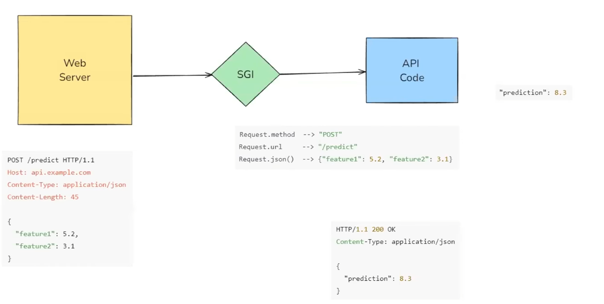

# **HTTP Methods**

| **Method** | **Action**      | **Idempotent** | **Use Case**               |
| ------ | ----------- | ---------- | ------------------------- |
| GET    | Read data   | ✅ Yes      | Fetch data from server    |
| POST   | Create data | ❌ No       | Submit forms, create item |
| PUT    | Update data | ✅ Yes      | Full update of a resource |
| DELETE | Delete data | ✅ Yes      | Remove a resource         |


# **Fast API** 
- FastAPI is a high-performance, modern web framework for building APIs with Python, based on standard Python type hints. 

- **The key features are**

    - **Fast:** Very high performance, on par with NodeJS and Go (thanks to Starlette and Pydantic). One of the fastest Python frameworks available.
    - **Fast to code:** Increase the speed to develop features by about 200% to 300%. *
    - **Fewer bugs:** Reduce about 40% of human (developer) induced errors. *
    - **Intuitive:** Great editor support. Completion everywhere. Less time debugging.
    - **Easy:** Designed to be easy to use and learn. Less time reading docs.
    - **Short:** Minimize code duplication. Multiple features from each parameter declaration. Fewer bugs.
    - **Robust:** Get production-ready code. With automatic interactive documentation.

# Wokring of Fast API:



1) **Web Server**
- **Purpose:** Acts as the first point of contact for incoming HTTP requests.

- **Functionality:** Receives client requests (like a browser or another server making an API call) and forwards them to the ASGI application.

- **Example:** Popular web servers include Nginx, Apache, or Caddy. In Python, this is often handled by Uvicorn or Hypercorn for ASGI applications.

```bash
POST /predict HTTP/1.1
Host: api.example.com
Content-Type: application/json
Content-Length: 45

{
    "feature1": 5.2,
    "feature2": 3.1
}
```
- **Role in FastAPI:** The web server listens on a port (e.g., 8000) and routes incoming HTTP requests to the ASGI layer.

2) **ASGI (Asynchronous Server Gateway Interface)**

- **Purpose:** Bridges the web server and the application code, handling the lifecycle of each request.

- **Why ASGI:** It is the asynchronous evolution of WSGI (Web Server Gateway Interface), designed to handle long-lived connections like WebSockets alongside regular HTTP traffic.

- **Flow (from above image):**

    * Receives the incoming HTTP request.

    * Converts it into a structured format that the FastAPI application can understand.

    * Passes it to the API code for processing.

    * Collects the response and sends it back to the web server for final delivery to the client.

    * **Benefits:** Non-blocking, scalable, and allows background tasks and real-time functionality.

3) **API Code (FastAPI)**

- **Purpose:** Contains the actual logic for processing incoming requests and returning appropriate responses.

- **Key Features:**

    * **Request Parsing:** Extracts JSON data into a Pydantic model (Features).

    * **Processing:** Runs the machine learning model or business logic.

    * **Response:** Returns a JSON response to the client.

- **Response (from above image):**

```bash
HTTP/1.1 200 OK
Content-Type: application/json

{
    "prediction": 8.3
}
```

#### End-to-End Flow in the Image:

- **Client Request:** A client sends a POST request to /predict with JSON payload.

- **ASGI Processing:** ASGI server (like Uvicorn) accepts the request and passes it to the FastAPI application.

- **API Logic:** FastAPI processes the data, runs the prediction, and generates a response.

- **Response Delivery:** The ASGI server sends the response back to the client.


# Fast API vs. Flask


# **Get Method**

## **Path Parameters**

- Path parameters are part of the URL path itself. They are used to capture dynamic values from the URL and pass them to your API function.

```bash
/items/{item_id}
```

- **Purpose:** Capture parts of the URL as variables.
- **Data Type:** You can enforce the data type (e.g., int, str, float) by specifying it in the function signature.
- **Required:** Always required as they are part of the URL.

## **Query Parameters**
- Query parameters are the key-value pairs in the URL, typically found after the ? in the URL. They are used for optional data, filtering, or additional parameters.

```bash
/items?name=book&price=20
```

- **Purpose:** Add optional parameters to your API without changing the URL structure.
- **Data Type:** Can also have type hints like strings, integers, booleans, lists, etc.
- **Optional:** Typically optional, and you can define default values.


### **Key Differences:**
 
| **Path Parameters**              | **Query Parameters**                     |
| -------------------------------- | ---------------------------------------- |
| Required in URL                  | Typically optional                       |
| Part of the URL structure        | After the `?` in the URL                 |
| Used for resource identification | Used for filtering or additional details |
| Fixed position in URL            | Can be unordered                         |


# **Post Method**

- Used to create or submit data to the server (e.g., creating a user, submitting a form).

## **Key Concepts:**

- 1. **Pydantic Models**
    * Used to define and validate request body.
    * Automatically converts and checks types.

- 2. **@app.post("/path/")**
    * Defines a route that listens for POST requests at /path/.

- 3. **Request Body Handling**
    * FastAPI reads and parses the JSON body into a Pydantic model.

- 4. **Response**
    * Returns any serializable object (e.g., dict, list, model).
    * Can be customized with response_model.

## **Request body**

- A request body is the portion of an HTTP request that contains data sent by the client to the server. It is typically used in HTTP methods such as POST, or PUT to transmit structured data (e.g., JSON, XML, form-data) for the purpose of creating or updating resources on the server. The server parses the request body to extract the necessary information and perform the intended operation. 

